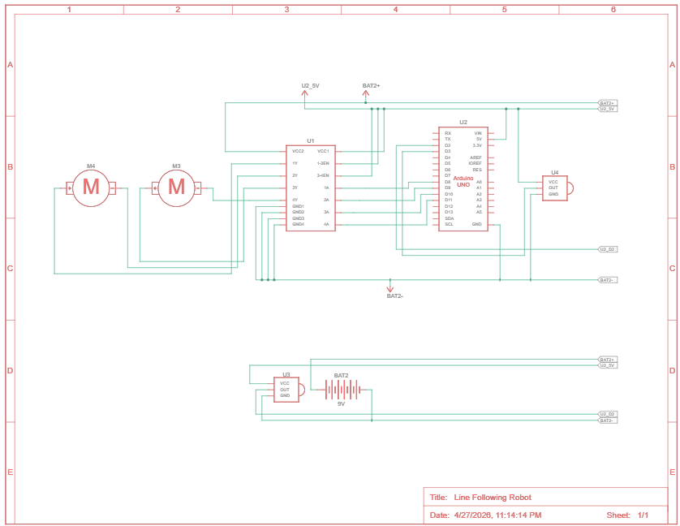
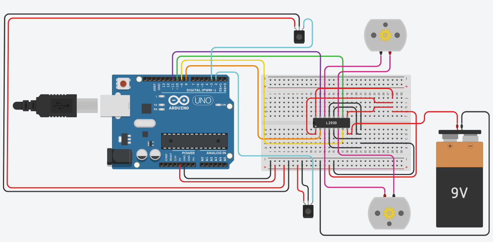

# 🤖 Line Following Robot

> An Arduino-based robot that autonomously follows a black line on a white surface using two IR sensors and an L293D motor driver.


---

## 📖 Overview

The **Line Following Robot** uses two infrared (IR) sensors to detect a black line against a white surface and drives two DC motors to keep the robot on track. The robot reads sensor values in real time and adjusts its movement — going forward, turning left, turning right, or stopping — based on where the line is detected.

---

## ✨ Features

- 📡 **Dual IR sensing** — left and right sensors for accurate line tracking
- ⚡ **Real-time response** — continuous loop reads and reacts to sensor changes instantly
- 🔄 **Four movement modes** — Forward, Turn Left, Turn Right, and Stop
- 🛠️ **Simple and extensible** — clean modular code with separate functions for each movement

---

## 🛠️ Hardware Components

| Component | Quantity |
|---|---|
| Arduino UNO | 1 |
| L293D Motor Driver IC | 1 |
| DC Motors | 2 |
| IR Sensor Modules | 2 |
| 9V Battery | 1 |
| Breadboard | 1 |
| Jumper Wires | As needed |

---

## 🔌 Circuit Diagram

> Built and simulated in Tinkercad

**Pin Connections:**

| Component | Arduino Pin |
|---|---|
| Left IR Sensor | Digital 2 |
| Right IR Sensor | Digital 3 |
| Left Motor Control 1 (LM1) | Digital 8 |
| Left Motor Control 2 (LM2) | Digital 9 |
| Right Motor Control 1 (RM1) | Digital 10 |
| Right Motor Control 2 (RM2) | Digital 11 |

### Schematic


### Circuit Layout


---

## 🚀 Getting Started

### Prerequisites

- Arduino IDE (1.8.x or 2.x)
- Arduino UNO board
- All hardware components listed above

### Installation

1. **Clone the repository**
   ```bash
   git clone https://github.com/deep-chatterjee/Line-Following-Robot-using-Arduino.git
   cd Line-Following-Robot-using-Arduino
   ```

2. **Open the sketch**
   - Open `Line_Following_Robot.ino` in the Arduino IDE

3. **Upload to your board**
   - Select your board: **Arduino UNO**
   - Select the correct COM port
   - Click **Upload**

4. **Assemble the circuit**
   - Wire up the components following the schematic images in the repo
   - Power the motors with the 9V battery via the L293D

---

## 💻 How It Works

The robot continuously reads both IR sensors and decides movement based on the combination:

```
Left = 1, Right = 1  →  Both on white  →  Go Forward
Left = 0, Right = 1  →  Left on line   →  Turn Left
Left = 1, Right = 0  →  Right on line  →  Turn Right
Left = 0, Right = 0  →  Both on line   →  Stop
```

> **Sensor logic:** `1` = white surface detected, `0` = black line detected

### Movement Flow

```
Read Left & Right IR Sensors
          ↓
   Evaluate sensor state
          ↓
 ┌────────┬────────┬──────────┐
 │Forward │TurnLeft│TurnRight │ Stop
 └────────┴────────┴──────────┘
          ↓
  Drive motors accordingly
          ↓
      Loop again
```

---

## 📁 Project Structure

```
Line-Following-Robot-using-Arduino/
├── Line_Following_Robot.ino          # Arduino sketch
├── Line_Following_Robot_Schematic.png  # Circuit schematic
├── Line_Following_Robot_Circuit.png    # Breadboard circuit layout
├── LICENSE
└── README.md
```

---

## 🧠 What I Learned

- IR sensor interfacing and digital signal reading on Arduino
- H-bridge motor control using the L293D driver IC
- State-based control logic for autonomous navigation
- Modular code structure for embedded systems

---

## 🔮 Future Improvements

- Add PWM speed control for smoother turns
- Implement PID control for more precise line tracking
- Add a third center IR sensor for better accuracy
- Bluetooth module (HC-05) for wireless speed/mode control
- OLED display to show sensor state in real time

---

## 👤 Author

**Deep Chatterjee**  
[GitHub](https://github.com/deep-chatterjee)

---

## 📄 License

This project is licensed under the MIT License — see [LICENSE](https://github.com/deep-chatterjee/Line-Following-Robot-using-Arduino/blob/main/LICENSE) for details.
